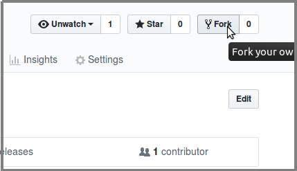
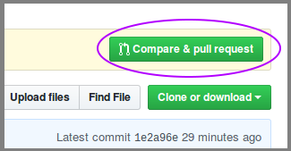

# Guided course

This is a simple quick-course in using git to make a contribution. Follow step by step and see your changes online!

## Fork the workshop repo

Go to <https://github.com/taikedz/git-workshop> in a web browser, and click the "Fork" button in the top right:



This wil give you your own version of the repo.

## Clone your repo

Say for example your repository is at `https://github.com/jsmith/git-workshop`

In your command environment, do

```sh
git clone https://github.com/jsmith/git-workshop

cd git-workshop
```

## Run the demo script

There is a runnable script in the repo. Try running it:

```sh
bash demo-script.sh
```

## Branch, and add your name

```sh
# Replace 'jsmith' with your name, no spaces.
git checkout -b add-jsmith
```

You now have two routes in front of you.

The "Fresh beginner" route allows you to make a PR with no side-effects. Choose this if you are very new to git and have had difficulties in the above steps.

The "Confident beginner" route introduces the new concept of "merge conflicts."
* Fresh beginners
    * Substituting an appropriate short name instead of `jsmith`, and your full name instead of `Jay Smith`, run a command like this:
    * `echo "Jay Smith" >> data/jsmith.txt`
* Confident beginners
    * Edit the file in `data/participants.txt` in a text editor directly
    * Add your name to the end of the file, save and close the file

Run the demo script again to see that your name is displayed!

```sh
bash demo-script.sh
```

> A "merge conflict" is what happens when two people edit the same lines in the same file. If two or more people in your session choose the "Confident beginner" route, those who make a PR after the first person may experience this, because the computer algorithm cannot process it meaningfully - like asking "which way did they go" and being told in response, "both ways!" Your session lead or their asssitants will be able to help you if you encounter difficulties - remember to preserve other peoples' changes when resolving a merge conflict!

## Stage, commit and push

Substitute your name and shortname for `(your name)` and `jsmith`

```sh
git add data/
git commit -m "Added (your name) to participants file"
git push --set-upstream origin add-jsmith
```

## Make a pull request

Go to github.com and choose to `Compare & pull request`



Fill in the dialog and submit. Now wait for your PR to be accepted

## Pull in changes from original repo

Those who chose the "Confident beginner" route: you may be asked to update your repo with the original repo. If so, the following is what you need to do on your own branch:

```sh
git pull https://github.com/taikedz/git-workshop master
```

* If you get a "merge conflict" message, edit the `data/participants.txt` file again to remove the conflict lines.
* Make sure to preserve any new names that have appeared.
* Then run
    * `git add data/`
    * `git commit -m "Pulled new changes, resolved conflicts"`
    * `git push`
* If no other changes from the rest of the workshop conflict with yours, your changes will be accepted
    * Otherwise, do the above steps again with the new changes

## You're done!

That's it! You successfully made a PR!

[Next >>](06_get_more_help.md)
